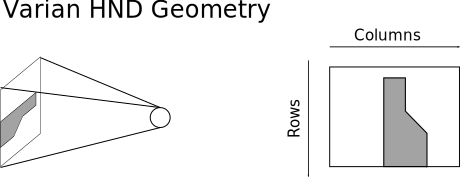

CBCT - Cone-beam computed tomography
====================================

HND Geometry
------------
By default, when you generate a DRR, the image is oriented as if the
virtual x-ray source were a camera.  That means that for a right
lateral film, the columns of the image go from inf to sup, and the
rows go from ant to post.  The Varian OBI system produces HND files,
which are oriented differently. For a right lateral film, the columns
of the HND images go from ant to post, and the rows go from sup to
inf.  An illustration of this idea is shown in the figure below. 

   Geometry of Varian HND files

