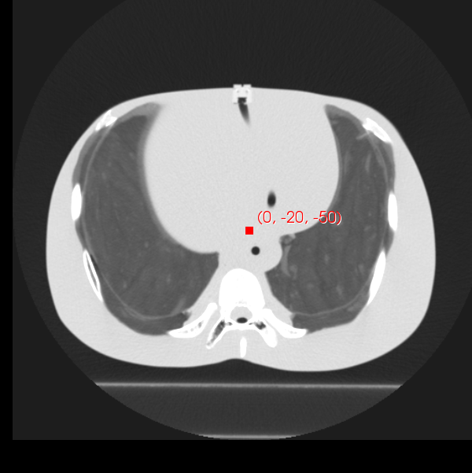
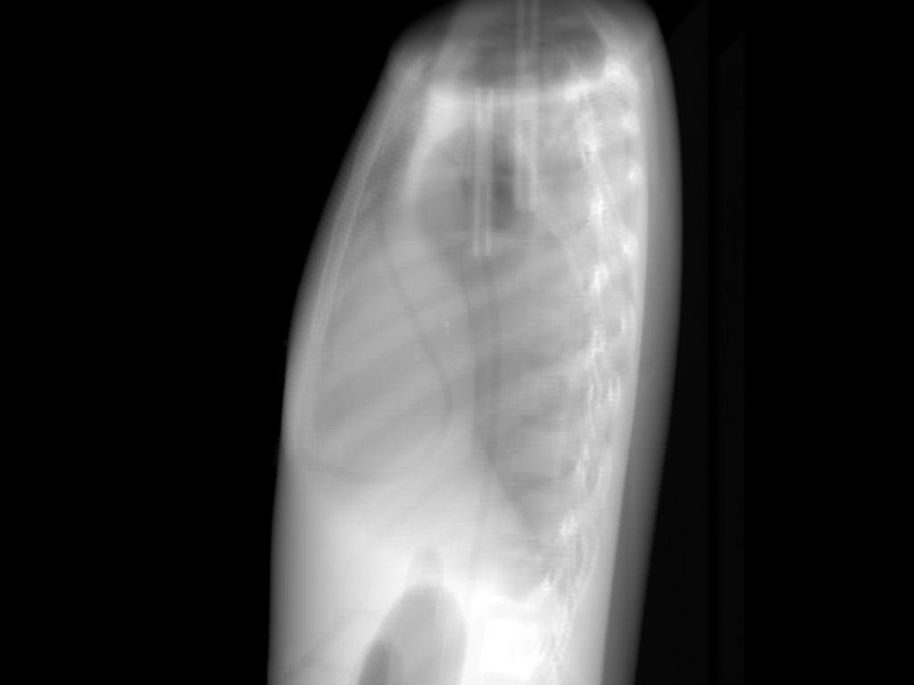
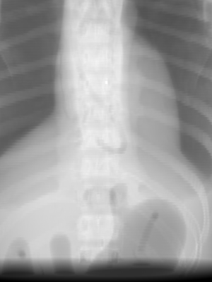
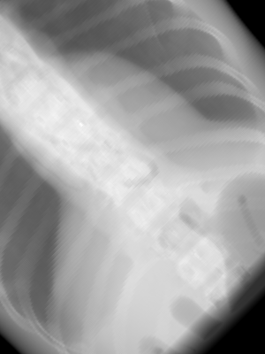
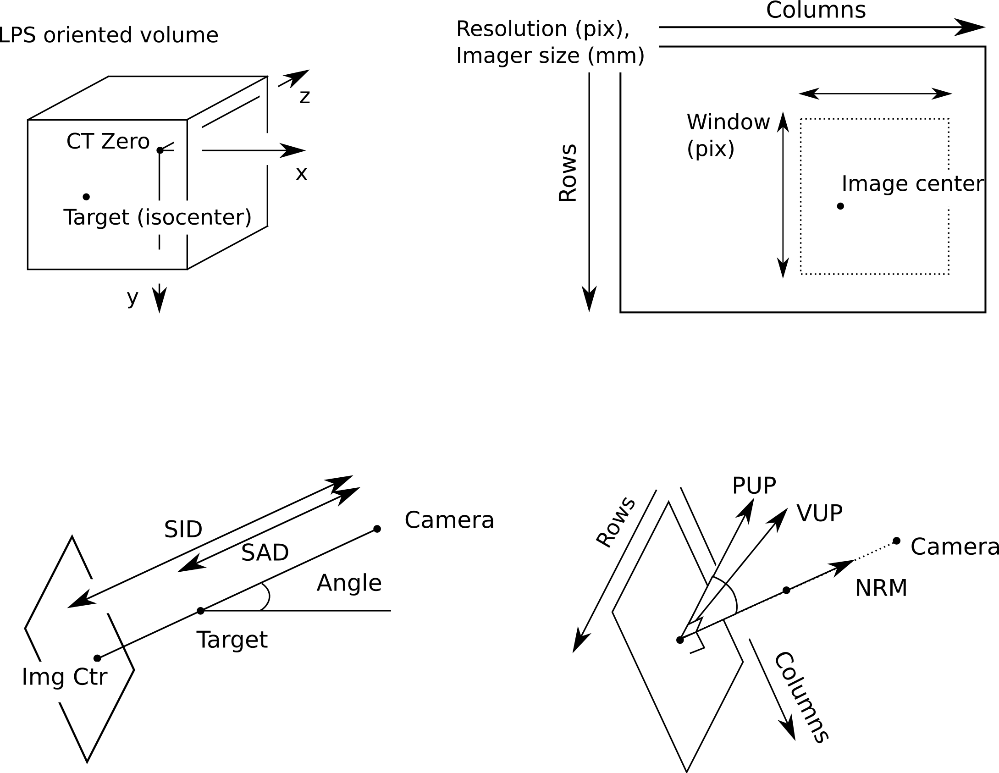
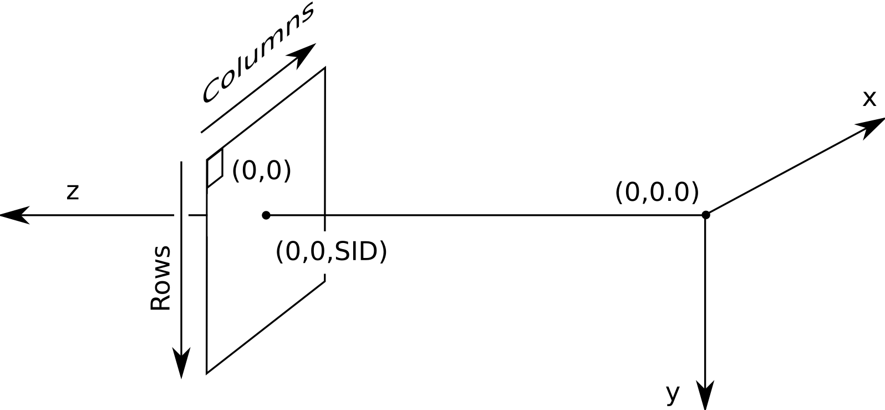

Digitally reconstructed radiographs (DRRs)
==========================================

A digitally reconstructed radiograph (DRR) is a synthetic radiograph 
which can be generated from a computed tomography (CT) scan.  
It is used as a reference image for verifying the correct setup 
position of a patient prior to radiation treatment.  

DRR usage
---------
The drr program that comes with plastimatch takes a CT image 
as input, and generates one or more output images.  The input image 
is in MHA format, and the output images can be either pgm, pfm, or raw 
format.  The command line usage is::

 Usage: drr [options] [infile]
 Options:
  -A hardware       Either "cpu" or "brook" or "cuda" (default=cpu)
  -a num            Generate num equally spaced angles
  -N ang            Difference between neighboring angles (in degrees)
  -nrm "x y z"      Set the normal vector for the panel
  -vup "x y z"      Set the vup vector (toward top row) for the panel
  -g "sad sid"      Set the sad, sid (in mm)
  -r "r c"          Set output resolution (in pixels)
  -s scale          Scale the intensity of the output file
  -e                Do exponential mapping of output values
  -c "r c"          Set the image center (in pixels)
  -z "s1 s2"        Set the physical size of imager (in mm)
  -w "r1 r2 c1 c2"  Only produce image for pixes in window (in pix)
  -t outformat      Select output format: pgm, pfm or raw
  -i algorithm      Choose algorithm {exact,uniform}
  -o "o1 o2 o3"     Set isocenter position
  -I infile         Set the input file in mha format
  -O outprefix      Generate output files using the specified prefix

The drr program can be used in either 
*single image mode* or *rotational mode*.  In single image mode, 
you specify the complete geometry of the x-ray source and imaging 
panel for a single image.  In rotational mode, the imaging geometry 
is assumed to be 

The command line options are described in more details as follows.

.. program:: drr

.. cmdoption:: -A hardware

   Choose the threading mode, which is either "cpu" or "cuda".  
   The default value is "cpu".  

   When using CPU hardware, DRR generation uses OpenMP for multicore 
   acceleration if your compiler supports this.  Gcc and Microsoft Visual 
   Studio Professional compilers support OpenMP, but 
   Microsoft Visual Studio Express does not.

   At the current time, cuda acceleration is not working.  

.. cmdoption:: -a num

   Generate num equally spaced angles

.. cmdoption:: -r "r1 r2"

   Set the resolution of the imaging panel (in pixels).  Here, r1 refers 
   to the number of rows, and r2 refers to the number of columns.

Single image mode
-----------------
The following example illustrates the use of single image mode::

  drr -nrm "1 0 0" \
      -vup "0 0 1" \
      -g "1000 1500" \
      -r "1024 768" \
      -z "400 300" \
      -c "383.5 511.5" \
      -o "0 -20 -50" \
      input_file.mha

In the above example, the isocenter is chosen to be 
(0, -20, -50), the location marked on the 
CT image.  The orientation of the projection image is controlled by 
the **nrm** and **vup** options.  Using the default values of (1, 0, 0) 
and (0, 0, 1) yields the DRR shown on the right:

By changing the normal direction (**nrm**), we can choose different 
beam direction within an isocentric orbit.  For example, an 
anterior-posterior (AP) DRR is generated with a normal of (0, -1, 0) 
as shown below:

The rotation of the imaging panel is selected using the **vup** option.
The default value of **vup** is (0, 0, 1), which means that the top 
of the panel is oriented toward the positive z direction in world 
coordinates.  If we wanted to rotate the panel by 45 degrees 
counter-clockwise on our AP view, we would set **vup** to 
the (1, 0, 1) direction, as shown in the image below.  
Note that **vup** doesn't have to be normalized.

Rotational mode
---------------
In rotional mode, multiple images are created.  The source and imaging 
panel are assumed to rotate in a circular orbit around the isocenter.  
The circular orbit is performed around the Z axis, and the images 
are generated every **-N ang** degrees of the orbit.  This is illustrated 
using the following example::

  drr -N 20 \
      -a 18 \
      -g "1000 1500" \
      -r "1024 768" \
      -z "400 300" \
      -o "0 -20 -50" \
      input_file.mha

In the above example, 18 images are generated at a 20 degree interval, 
as follows:

.. image:: ../figures/drr_output_4.png
   :width: 70 %

DRR geometry
------------

The DRR code generates images from a volume, using the following
geometry description:

+-----------+-----------------+-----------------------------------------+
|Inputs     |Units            |Default Value                            |
|           |                 |                                         |
+===========+=================+=========================================+
|SID        |mm               |1630                                     |
+-----------+-----------------+-----------------------------------------+
|SAD        |mm               |1000                                     |
+-----------+-----------------+-----------------------------------------+
|Angle      |degrees          |0                                        |
+-----------+-----------------+-----------------------------------------+
|Target     |3d position (mm) |(0,0,0)                                  |
|           |                 |                                         |
|           |                 |                                         |
+-----------+-----------------+-----------------------------------------+
|Camera     |3d position (mm) |*Computed from Target, Angle and SAD*    |
|           |                 |                                         |
|           |                 |                                         |
+-----------+-----------------+-----------------------------------------+
|CT Zero    |3d position (vox)|*Read from input volume*                 |
|           |                 |                                         |
+-----------+-----------------+-----------------------------------------+
|Panel      |pixels           |1024 x 768                               |
|resolution |                 |                                         |
+-----------+-----------------+-----------------------------------------+
|Panel size |mm               |400 x 300                                |
+-----------+-----------------+-----------------------------------------+
|Window     |pixels           |Same as resolution                       |
|           |                 |                                         |
+-----------+-----------------+-----------------------------------------+
|NRM        |3d direction     |*Computed from Target and Camera*        |
|           |                 |                                         |
|           |                 |                                         |
+-----------+-----------------+-----------------------------------------+
|VUP        |3d direction     |*Hard coded to (0,0,1)*                  |
|           |                 |                                         |
+-----------+-----------------+-----------------------------------------+
|Panel      |3d direction     |*Computed from NRM and VUP*              |
|Orientation|                 |                                         |
|           |                 |                                         |
+-----------+-----------------+-----------------------------------------+

   Geometry attributes of a DRR

   Intrinsic geometry for DRR computation

The intrinsic geometry is specified by the equation:

.. math::

   K = \left[
     \begin{array}{cccc}
     1/\alpha & 0 & 0 & c_i \\
     0 & 1 / \beta & 0 & c_j \\
     0 & 0 & f & 0
     \end{array}
     \right]
