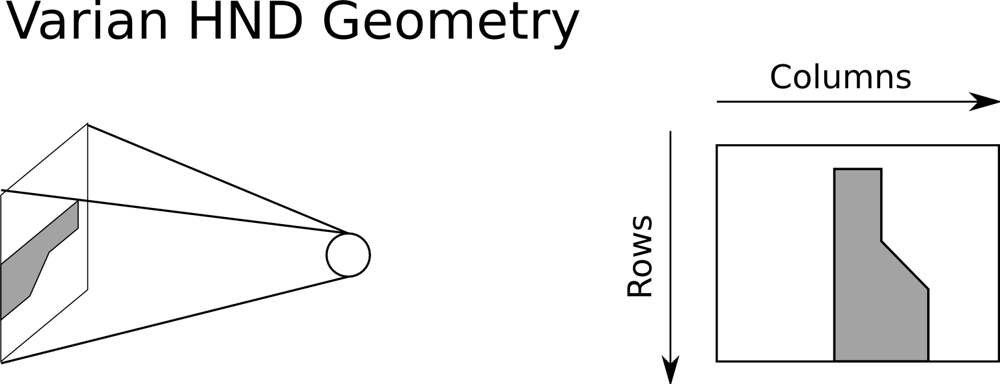

fdk
===
The term FDK refers to the authors 
Feldkamp, Davis, and Kress who wrote the seminal paper 
"Practical cone-beam algorithm" in 1984.  Their paper 
describes a filtered back-projection reconstruction algorithm 
for cone-beam geometries.  The fdk program in plastimatch is 
an implmenetation of the FDK algorithm.

FDK usage
---------
The fdk program takes a directory of 2D projection images as input, and 
generates a single 3D volume as output.  

The command line usage is::

  Usage: fdk [options]
  Options:
   -A hardware            Either "cpu" or "brook" or "cuda" (default=cpu)
   -a "num ((num) num)"   Use this range of images
   -r "r1 r2 r3"          Set output resolution (in voxels)
   -f filter              Either "none" or "ramp" (default=ramp)
   -s scale               Scale the intensity of the output file
   -z "s1 s2 s3"          Physical size of the reconstruction (in mm)
   -I indir               The input directory
   -O outfile             The output file
   -F {F,H}               Full or half fan bow-tie filter correction

The usage of the fdk program is best understood by following along 
with the tutorials: :ref:`fdk_tutorial_i` and :ref:`fdk_tutorial_ii`.

Input files
-----------
Three different formats of input files are supported.  These are:

- Pfm format image files with geomtry txt files
- Raw format image files with geomtry txt files
- Varian hnd files

The pfm and raw files are similar, in that they store the image as 
an array of 4-byte little-endian floats.  The only difference is that 
the pfm file has a header which stores the image size, and the raw file 
does not.

Each pfm or raw image file must have a geometry file in the same directory 
with the .txt extension.  For example, if you want to use image_0000.pfm
in a reconstruction, you should supply another file image_0000.txt 
which contains the geometry.  
A brief description of the geometry file format is given in 
:ref:`proj_mat_file_format`.

The sequence of files should be stored with the pattern:

  XXXXYYYY.ZZZ

where XXXX is a prefix, YYYY is a number, and .ZZZ is the extension 
of a known type (either .hnd, .pfm, or .raw).

For example the following would be a good directory layout for pfm files::

  Files/image_00.pfm
  Files/image_00.txt
  Files/image_01.pfm
  Files/image_01.txt
  etc...

The Varian hnd files should be stored in the original layout.  For example::

  Files/ProjectionInfo.xml
  Files/Scan0/Proj_0000.hnd
  Files/Scan0/Proj_0001.hnd
  etc...

No geometry txt files are needed to reconstruct from Varian hnd format.

Image geometry
--------------
By default, when you generate a DRR, the image is oriented as if the
virtual x-ray source were a camera.  That means that for a right
lateral film, the columns of the image go from inf to sup, and the
rows go from ant to post.  The Varian OBI system produces HND files,
which are oriented differently. For a right lateral film, the columns
of the HND images go from ant to post, and the rows go from sup to
inf.  An illustration of this idea is shown in the figure below. 

   Geometry of Varian HND files
