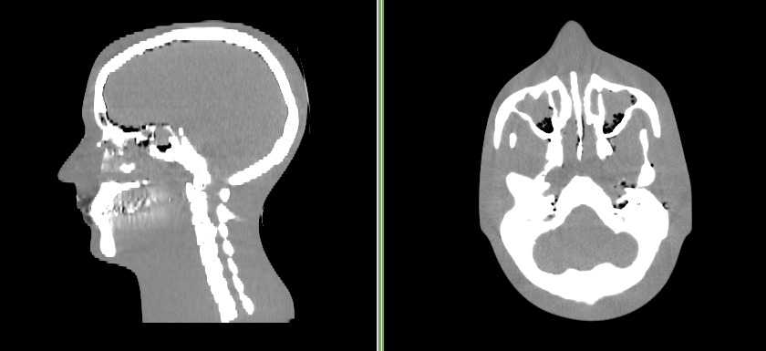
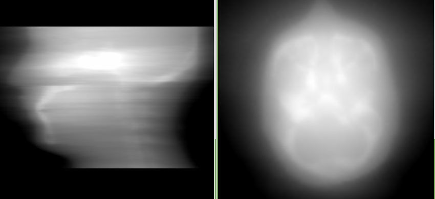
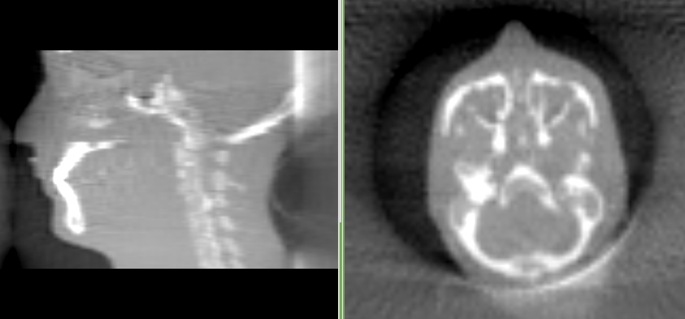
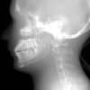
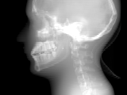
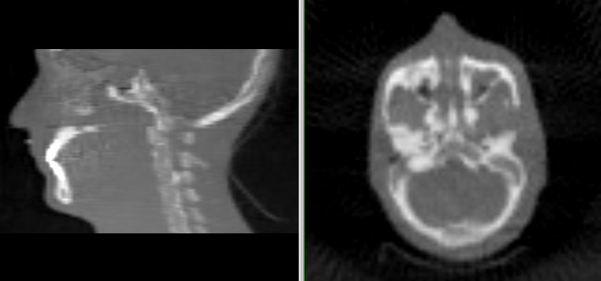
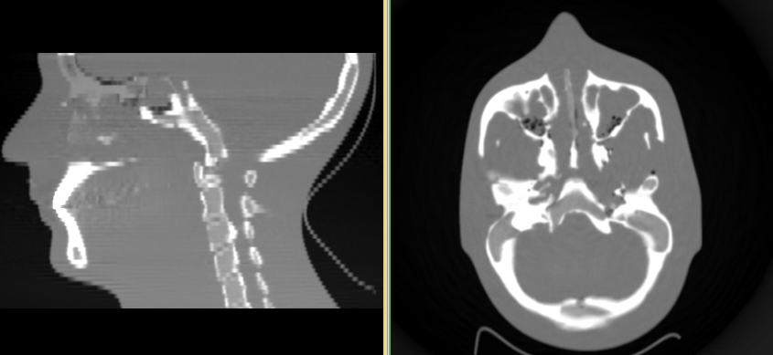

.. _fdk_tutorial:

FDK Tutorial
============
This tutorial demonstrates the use of the FDK program.  It is highly 
recommended to try this tutorial before attempting to reconstruct your 
own images.  

The basic procedure we will follow is to generate synthetic X-ray projection 
images using the drr program, and then reconstruct them using the fdk 
program.  

Download the sample data
^^^^^^^^^^^^^^^^^^^^^^^^
http://forge.abcd.harvard.edu/gf/download/frsrelease/85/1018/headphantom.mha.zip

The sample data is a 3D volume of a CT scan of an acrylic head phantom. 
You can see what the original image looks below.

Make DRRs (first try)
^^^^^^^^^^^^^^^^^^^^^
Run the following command to create drr images::

  drr \
      -t pfm \
      -a 60 \
      -N 3 \
      -g "1000 1500" \
      -r "100 100" \
      -z "300 300" \
      -I headphantom.mha \
      -O head/

Note that the "/" at the end of the output directory "head" is important.
If you forget this, the projection files will be created in the current 
directory.  What you should get is a bunch of files in a directory 
like this::

  head/0000.pfm
  head/0000.txt
  head/0001.pfm
  head/0001.txt
  ...

Reconstruct the image (first try)
^^^^^^^^^^^^^^^^^^^^^^^^^^^^^^^^^
Run the following command to reconstruct the image::

  fdk -f none -r "100 100 100" -I head -O out.mha

You should get an image like this:

The image is kind of blurry, which is because we didn't use the ramp filter.
Try again with the ramp filter::

  fdk -f ramp -r "100 100 100" -I head -O out.mha

You should get an image like this:

The artifact at the posterior of the skull is a truncation artifact, which 
is caused by missing data in the DRRs that we generated in the previous 
step.  So let's work on it, and get rid of it.

Looking at the DRRs
^^^^^^^^^^^^^^^^^^^
In order to get better control over the DRR generation process, we need 
to actually look at the DRRs.  But unfortunately, there are not many 
good viewers for floating point images (especially for pfm format).  
Therefore we are going to make the drrs in pgm format first, and when 
we are satisfied with the results, we can make them in pfm.

Run the following command to create drr images in pgm format::

  drr \
      -t pgm \
      -a 60 \
      -N 3 \
      -g "1000 1500" \
      -r "100 100" \
      -z "300 300" \
      -I headphantom.mha \
      -O head/

If you didn't delete the old images, you should see this::

  head/0000.pfm
  head/0000.pgm
  head/0000.txt
  head/0001.pfm
  head/0001.pgm
  head/0001.txt
  ...

When you look at the image in the image viewer such as gimp, you see this:

Not very interesting, is it.  The problem is that the pgm is stored as 
16-bit grayscale (values between 0 and 65535), 
but the DRR generates as floating point and doesn't 
auto-scale the output.  You need to manually scale it in order to 
see something interesting.  Like this::

  drr \
      -t pgm \
      -a 60 \
      -N 3 \
      -s 150000 \
      -g "1000 1500" \
      -r "100 100" \
      -z "300 300" \
      -I headphantom.mha \
      -O head/

Which yields the following:

The truncation of the posterior of the head is clearly seen in the upper right 
corner of the image.

You might be wondering how I knew to scale by the value of 150000?  
For this, I used the "plastimatch stats" command to query the values in the 
pfm file::

  $ plastimatch stats head/0000.pfm
  Image center: 49.5 49.5
  Projection matrix: 0 0.333333 0 0 0 0 -0.333333 0 -0.000666667 0 0 0.666667 
  MIN 0.000000 AVE 0.234049 MAX 0.588337 NUM 10000

Looking at the AVE and MAX values, I roughly estimated that multiplying 
the original values by 150000 would scale the intensities to the range 
(0 and 65535).  

Make DRRs (second try)
^^^^^^^^^^^^^^^^^^^^^^
There are several things I could do to fix the truncated projections, 
but the simplest is probably to make a bigger detector.  The old detector 
was 30 x 30 cm.  Let's try a 30 x 40 detector, with a height of 30 cm 
and width of 40 cm.
We'll also increase the number of pixels a little to keep the pixels square.
::

  drr \
      -t pfm \
      -a 60 \
      -N 3 \
      -g "1000 1500" \
      -r "120 160" \
      -z "300 400" \
      -I headphantom.mha \
      -O head/

Which yields new DRRs with an increased field of view. 

Reconstruct the image (second try)
^^^^^^^^^^^^^^^^^^^^^^^^^^^^^^^^^^
Run the following command to reconstruct the image::

  fdk -f ramp -r "100 100 100" -I head -O out.mha

You should get an image like this:

While this image doesn't have a truncation artifact, it quite low 
resolution.  For our final effort, we will use more realistic 
image sizes.

Make DRRs (last try)
^^^^^^^^^^^^^^^^^^^^
Let's generate projection images that are equivalent to those acquired 
by a clinical radiotherapy scanner.  Each image will be 
768 x 1024 resolution (~0.380 mm at isocenter), and 
we'll acquire 630 images per rotation.
::

  drr \
      -t pfm \
      -a 630 \
      -N 0.5714286 \
      -g "1000 1500" \
      -r "768 1024" \
      -z "300 400" \
      -I headphantom.mha \
      -O head/

It takes a long time.  On my linux computer at home it took 17.0 minutes.

Reconstruct the image (last try)
^^^^^^^^^^^^^^^^^^^^^^^^^^^^^^^^
When we reconstruct the images, we will change the resolution to 
512 x 512 x 120, and reconstruct a volume of size 30 x 30 x 15 cm.
This is equivalent to 1.25 mm slices, with an in-plane pixel size 
of 0.586 x 0.586 mm.
::

  fdk -f ramp -r "512 512 120" -z "300 300 150" -I head -O out.mha

You should get an image like this:

This also takes a long time, but not quite as long as the DRR generation.  
On my linux computer at home it takes between 3 and 5 minutes.  
But the image quality is much improved over the low resolution version.

