.. _fdk_tutorial_ii:

FDK Tutorial (Part II)
======================
This is Part II of the FDK tutorial.  You will download sample projection 
data from a real CT scanner, convert the data format to something that 
the fdk program can use, generate geometry files that match the projection 
data, and reconstruct a 3D volume from projections.

IMPORTANT: This tutorial requires the use of either Matlab or Octave to 
convert the image file format.  You will not be able to complete the 
tutorial without one of these. 

Download the sample data
^^^^^^^^^^^^^^^^^^^^^^^^
http://forge.abcd.harvard.edu/gf/download/frsrelease/85/1446/micro-ct-projections.zip

The data for this tutorial was generously donated by Ming Chao (Howard).
The images show a calibration plate, and were taken with the CBCT scanner 
for a small animal irradiation platform at the University of Arkansas 
for Medical Sciences in Little Rock.

You can see representative samples of the original images below.

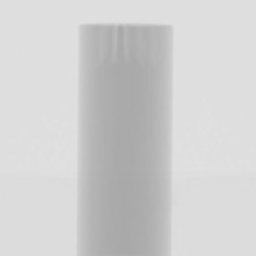
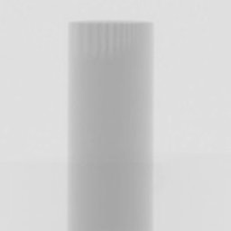
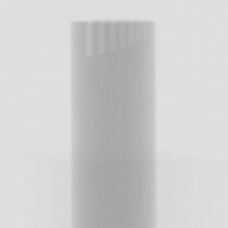

Converting the image files (First try)
^^^^^^^^^^^^^^^^^^^^^^^^^^^^^^^^^^^^^^
The sample data is stored in pgm format, in the pgm subdirectory.  
However, the recommended format for use with the fdk program is
the pfm format.  So our first step is to convert the file format to pfm 
format.

If you look in the matlab directory, you will see a conversion script called 
pgm_to_pfm.m.  Before running it, let's look at its contents::

 indir = '../pgm';
 outdir = '../pfm';
 enable_corrections = 0;

 d = dir ([indir, '/', '*.pgm']);
 for i = 1:size(d)
    infile = d(i).name;
    outfile = [outdir, '/', infile(1:end-3), 'pfm'];
    infile = [indir, '/', infile];
    a = imread (infile);
    if (enable_corrections)
        a = 211 - a;
        a(a<0) = 0;
    end
    savepfm (a, outfile);
 end

The conversion script reads all images "\*.pgm" in the directory "../pgm", 
and then writes them in pfm format in the directory "../pfm".  
There is a mysterious section which changes the image intensities 
if "enable_corrections" non-zero.  For now just leave that part alone.  

Running the script in Octave
^^^^^^^^^^^^^^^^^^^^^^^^^^^^
This section describes how to run the conversion script in Octave.  
If you are already an skilled Matlab or Octave user, you can just run the 
script and skip to the next section.

`Octave <http://www.gnu.org/software/octave/>`_ 
is a high-level language for 
numerical computations.  It is free software and is available on a wide 
variety of platforms, including Unix-like, Microsoft, and Apple 
operating systems.

When you start up Octave, you will be presented with a command prompt, 
like this::

  octave:1>

Change directory to the matlab directory in the package you downloaded.
You can use "cd" and "ls" command, just like in Unix::

  octave:1> cd ~/micro-ct-projections/matlab
  octave:2> ls
  pgm_to_pfm.m  savepfm.m
  octave:3>

And finally run the script::

  octave:3> pgm_to_pfm
  octave:4> 

Now, look in the pfm directory.  You should have a bunch of pfm files::

  octave:4> ls ../pfm
  Tnew_0000.pfm  Tnew_0072.pfm  Tnew_0144.pfm  Tnew_0216.pfm  Tnew_0288.pfm
  Tnew_0001.pfm  Tnew_0073.pfm  Tnew_0145.pfm  Tnew_0217.pfm  Tnew_0289.pfm
  Tnew_0002.pfm  Tnew_0074.pfm  Tnew_0146.pfm  Tnew_0218.pfm  Tnew_0290.pfm
  Tnew_0003.pfm  Tnew_0075.pfm  Tnew_0147.pfm  Tnew_0219.pfm  Tnew_0291.pfm
  ...

Hit 'q' to exit from the pager.  You can now exit Octave if you like, 
but we will be using again soon.

Creating the geometry files (First try)
^^^^^^^^^^^^^^^^^^^^^^^^^^^^^^^^^^^^^^^
As you learned in Part I of the tutorial, the fdk program expects each image 
to have an associated geometry file, which describes the location and 
orientation of the imaging system in room coordinates.  In this section, 
we will first describe the geometry of the real scanner, and then use 
the drr program to create the geometry files.

The University of Arkansas scanner consists of a fixed X-ray tube and 
detector, and uses a turntable to rotate the sample.  The X-ray system 
has the following attributes::

  SAD (x-ray source to rotation center) = 42.5cm
  SDD (x-ray source to imager) = 56 cm
  Imager resolution: du (row) = dv (column) = 0.04cm

The actual images are 1028 x 1026 pixels, but have been cropped to 
256 x 256 pixel subwindows for the purpose of this tutorial.  The imaging 
system is mechanically aligned with the rotational axis of the turntable, 
so that the optical axis is orthogonal to the rotational axis, and the 
panel columns are parallel to rotational axis.  Within the 256 x 256 
pixel subwindow the image center is located at pixel (154,154).

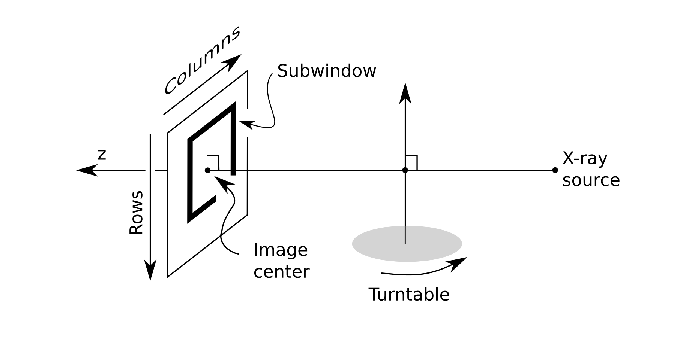

We now have enough information to create the geometry files.  The drr 
program can create geometry files for images that lie on a circular orbit, 
such as the turntable system.

Run the following from within the pfm directory::

  drr \
    -G \
    -a 360 -N 1 \
    -g "425 560" \
    -r "256 256" \
    -c "154 154" \
    -z "102.4 102.4" \
    -O Tnew_

Most of the command parameters should be pretty clear (you can refer to 
:ref:`drr` for details).  But just to point out a few comments:

* The -G parameter means to make geometry files without creating a drr
* All parameters are assumed to be in millimeters
* The "-z" parameter is for the subwindow, so 256 pix x 0.4 mm = 102.4 mm
* We are lucky that the image filenames have 4 digit numbers, which 
  match the filename pattern created by the drr program

Reconstructing the image (First try)
^^^^^^^^^^^^^^^^^^^^^^^^^^^^^^^^^^^^
We are now ready to reconstruct the image.  Run the following from within 
the pfm directory::

  fdk .

This should create a file "output.mha".  You can view this file in 
a software such as `3D Slicer <http://slicer.org/>`_.

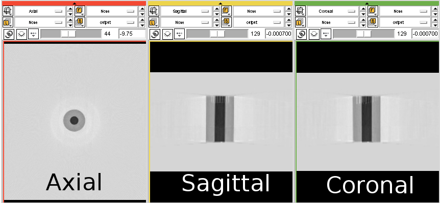

You might have noticed that the object is black 
(the color of air), and the background is white (the color of water or bone).  
We'll fix this soon.

You also might have noticed that we are reconstructing a larger region 
of interest than we need.  To choose a smaller region of interest, 
we can use the "-z" option.

Converting the image files (Second try)
^^^^^^^^^^^^^^^^^^^^^^^^^^^^^^^^^^^^^^^
The reason the background is not black is that the fdk program expects 
the input files to be zero for no attenuation, and 
non-zero values represent increasing amount of attenuation.
We will fix this problem by modifying the input files to the fdk program.

Go back to the file pgm_to_pfm.m, and change this line::

 enable_corrections = 0;

To look like this::

 enable_corrections = 1;

When you do this, pixels will be transformed according to the following 
formula::

 a = 211 - a;
 a(a<0) = 0;

This means that any pixel which have value 211 or brighter will be set 
to zero, and darker pixels will become increasingly bright.

If you haven't done so, save your changes, and re-run the pgm_to_pfm 
script.  The modified files will look like this.

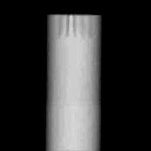
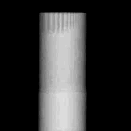
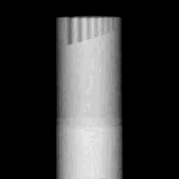

Reconstructing the image (Second try)
^^^^^^^^^^^^^^^^^^^^^^^^^^^^^^^^^^^^^
We are now ready to reconstruct the image (again).  
Run the following from within the pfm directory::

  fdk \
    -z "80 80 120" \
    -r "80 80 120"

Which generates the following image.

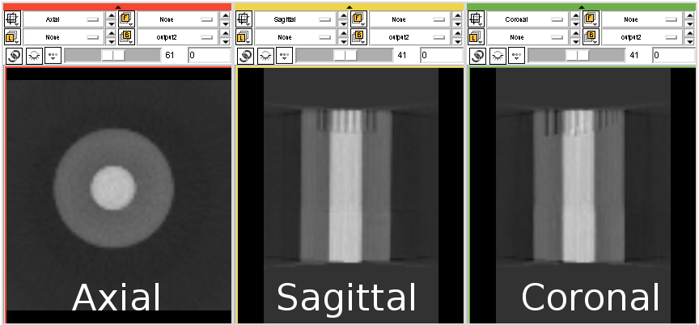

This image looks better, but seems to be composed of a high density 
inner cylinder surrounded by a low density outer cylinder.  
Looking at the projection images, however, suggests that the
object is a cylinder of uniform density.  This suggests a mismatch 
in the geometry.  We will fix this by modifying the geometry files.

Creating the geometry files (Second try)
^^^^^^^^^^^^^^^^^^^^^^^^^^^^^^^^^^^^^^^^
The problem with the geometry files can be fixed by modifying the 
value of the image center.  It is highly educational to try out 
different settings and see what you get.  

Two illustrate this point, 
we will try out two different values for the image center: 
(154,138) and (154,132.3).  The commands for these two cases 
are::

  drr \
    -G \
    -a 360 -N 1 \
    -g "425 560" \
    -r "256 256" \
    -c "154 138" \
    -z "102.4 102.4" \
    -O Tnew_

and::

  drr \
    -G \
    -a 360 -N 1 \
    -g "425 560" \
    -r "256 256" \
    -c "154 132.3" \
    -z "102.4 102.4" \
    -O Tnew_

Reconstructing the image (Last try)
^^^^^^^^^^^^^^^^^^^^^^^^^^^^^^^^^^^
For each of the above geometry settings, run the fdk command to 
reconstruct the CT volume.::

  fdk \
    -z "80 80 120" \
    -r "80 80 120"

The reconstruction for image center (154,138) looks like this:

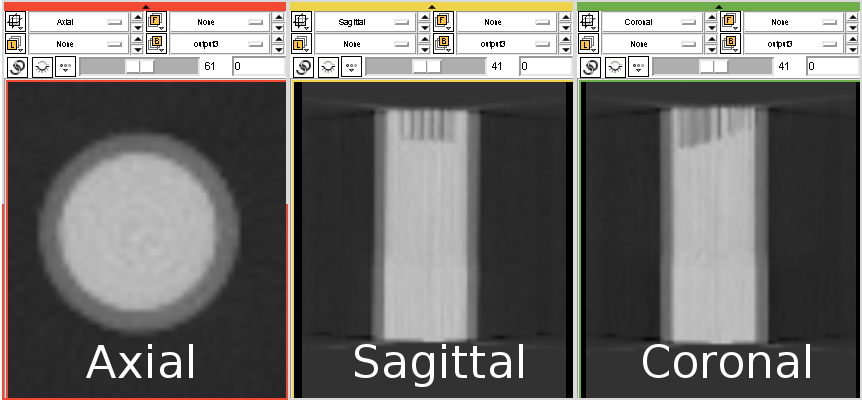

And the reconstruction for image center (154,132.3) looks like this:

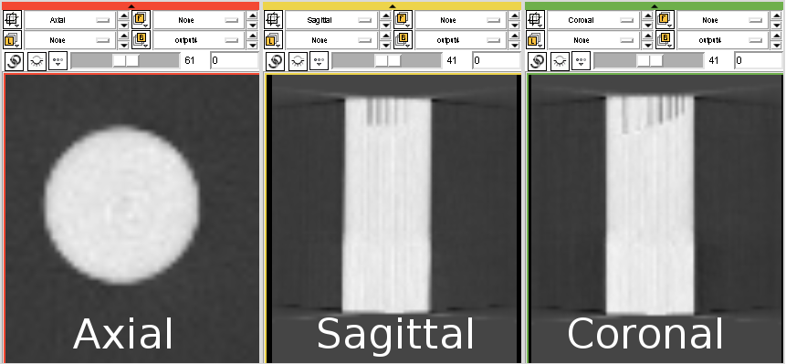

As you can see, setting the image center to (154,132.3) gives a good 
overall reconstruction of the object.  As a final test, let's make a 
high resolution reconstruction of the phantom::

  fdk \
    -z "50 50 85" \
    -r "512 512 85"

Which looks like this:

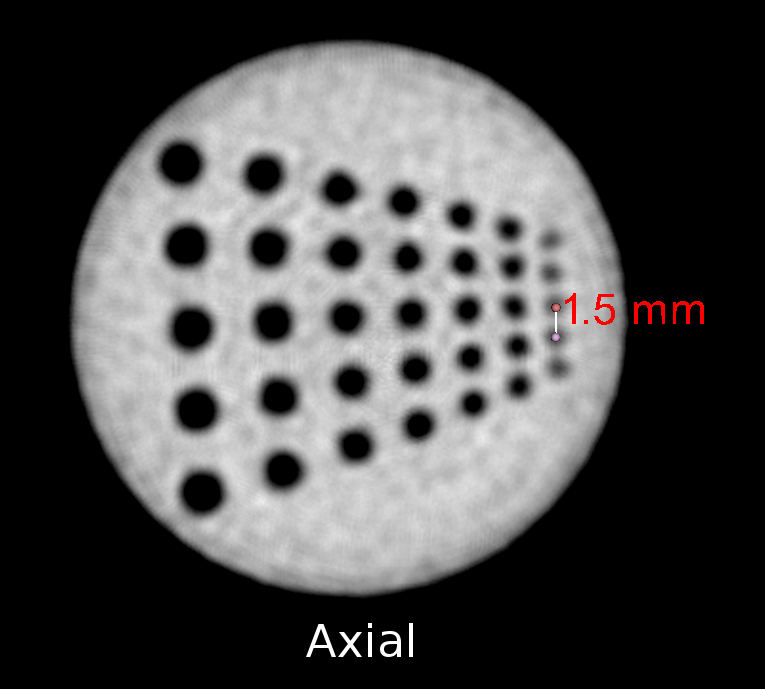

