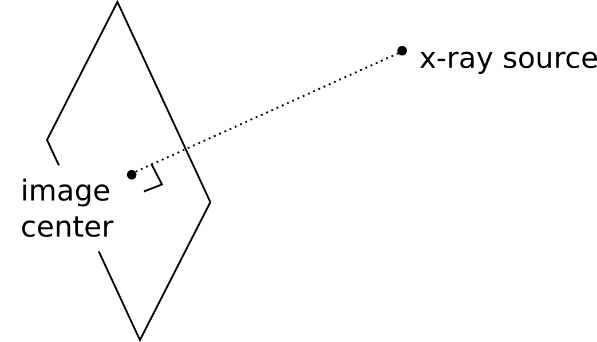
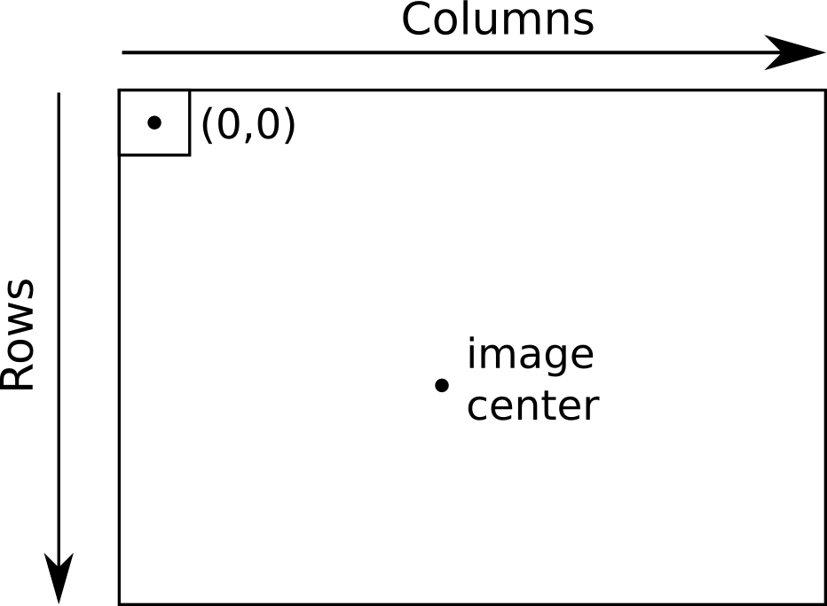
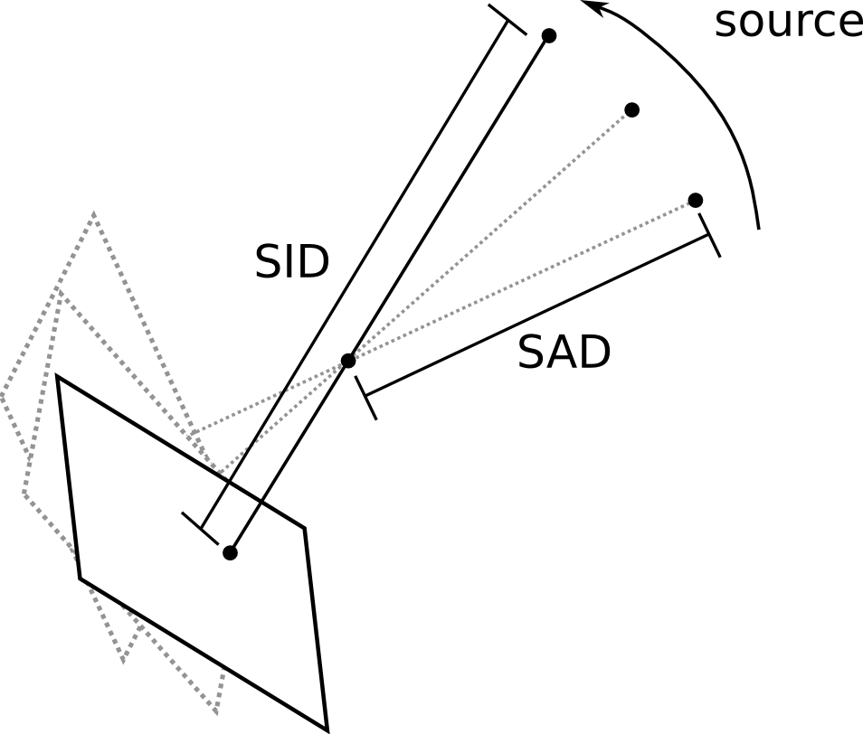
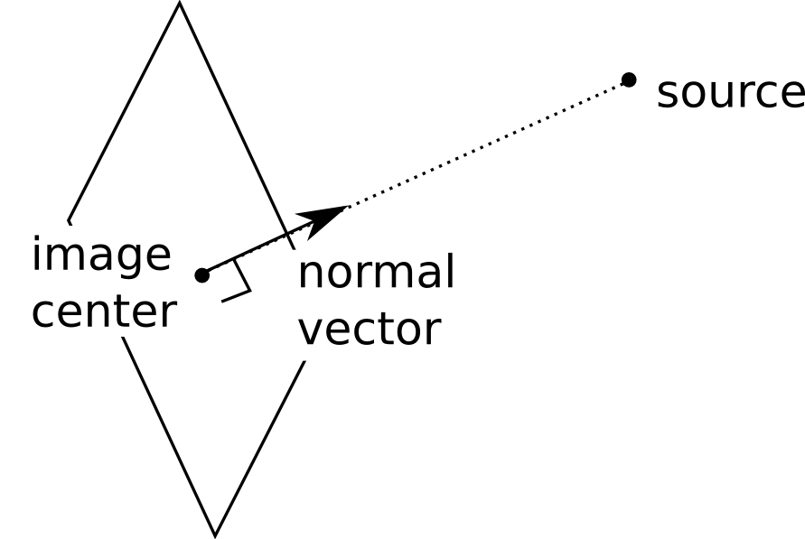
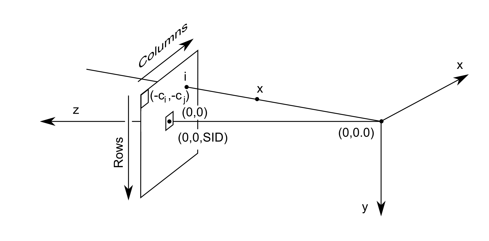

.. _proj_mat_file_format:

Projection matrix file format
-----------------------------
The projection matrices are stored in an ASCII file format, and 
include the complete geometry needed for DRR computation 
or CBCT reconstruction.  These files are created by the program 
"drr", and used by the program "fdk".

The following example is a valid projection matrix file::

    6.35000000e+01     6.35000000e+01
    0.00000000e+00     2.13333333e-01     0.00000000e+00     0.00000000e+00
    0.00000000e+00     0.00000000e+00    -2.13333333e-01     0.00000000e+00
   -6.13496933e-04     0.00000000e+00     0.00000000e+00     6.13496933e-01
    1.00000000e+03
    1.63000000e+03
   -1.00000000e+00    -0.00000000e+00    -0.00000000e+00
 Extrinsic
   -0.00000000e+00     1.00000000e+00    -0.00000000e+00     0.00000000e+00
    0.00000000e+00    -0.00000000e+00    -1.00000000e+00     0.00000000e+00
   -1.00000000e+00    -0.00000000e+00    -0.00000000e+00     1.00000000e+03
    0.00000000e+00     0.00000000e+00     0.00000000e+00     1.00000000e+00
 Intrinsic
    2.13333333e-01     0.00000000e+00     0.00000000e+00     0.00000000e+00
    0.00000000e+00     2.13333333e-01     0.00000000e+00     0.00000000e+00
    0.00000000e+00     0.00000000e+00     6.13496933e-04     0.00000000e+00

The meaning of each of the fields is explained below.  Note, however, that 
comments are not allowed, so this example cannot be loaded 
without first removing the explanations::

    # Image center (in pixels)
    6.35000000e+01     6.35000000e+01
    # Projection matrix
    0.00000000e+00     2.13333333e-01     0.00000000e+00     0.00000000e+00
    0.00000000e+00     0.00000000e+00    -2.13333333e-01     0.00000000e+00
   -6.13496933e-04     0.00000000e+00     0.00000000e+00     6.13496933e-01
    # SAD
    1.00000000e+03
    # SID
    1.63000000e+03
    # Normal vector
   -1.00000000e+00    -0.00000000e+00    -0.00000000e+00
    # Extrinsic portion of projection matrix
 Extrinsic
   -0.00000000e+00     1.00000000e+00    -0.00000000e+00     0.00000000e+00
    0.00000000e+00    -0.00000000e+00    -1.00000000e+00     0.00000000e+00
   -1.00000000e+00    -0.00000000e+00    -0.00000000e+00     1.00000000e+03
    0.00000000e+00     0.00000000e+00     0.00000000e+00     1.00000000e+00
    # Intrinsic portion of projection matrix
 Intrinsic
    2.13333333e-01     0.00000000e+00     0.00000000e+00     0.00000000e+00
    0.00000000e+00     2.13333333e-01     0.00000000e+00     0.00000000e+00
    0.00000000e+00     0.00000000e+00     6.13496933e-04     0.00000000e+00

Image center
^^^^^^^^^^^^
The *image center* is the 2D coordinate, in pixel coordinates, of the 
point on the image which is closest to the x-ray source.  
Or to explain in another way, if you draw a line 
through the source that is also perpendicular to the image, that line 
intersects the image at the image center.  

The image center is a pair of floating point numbers, in units of pixels.
The first number is the column, the second number is the row.  
The first pixel of the image is considered to be coordinate (0,0).  
The image center does not need to lie within the bounds of the image.

SID and SAD
^^^^^^^^^^^
The *SID* is the source-to-image distance, and the *SAD* is the 
source-to-axis distance.  The SID is simply the 3D distance from 
the source to the image center.  The SAD assumes a rotation axis, 
typically the axis of gantry rotation for cone-beam CT acquisition.
The units for these quantities are millimeters.

Normal vector
^^^^^^^^^^^^^
The *normal vector* refers to the world coordinate normal vector of the 
imaging device.  It is the unit vector that points to the 
x-ray source as seen from the image center.

Projection matrix
^^^^^^^^^^^^^^^^^
The *projection matrix* is the 3 x 4 matrix the maps homogenous world 
coordinates into homogenous pixel coordinates.  

A homogenous world coordinate is a 4 x 1 vector.  You can convert a 3D 
coordinate (x,y,z) into homogenous coordinates by appending a 1: (x,y,z,1).  
You can convert a homogenous coordinate (x,y,z,w) into a 3D 
coordinate by first dividing each element by w, and then taking the 
first three elements.

.. math::

   (x,y,z) \rightarrow (x,y,z,1)

.. math::

   (x,y,z,w) \rightarrow (x/w,y/w,z/w)

A similar procedure will convert 2D pixel coordinates to and 
from homogenous coordinates.

.. math::

   (i,j) \rightarrow (i,j,1)

.. math::

   (i,j,k) \rightarrow (i/k,j/k)

Let:

.. math::

   \bf{i} :=
   \left[\begin{array}{c} i \\ j \\ k \end{array} \right]

.. math::

   \bf{x} :=
   \left[\begin{array}{c} x \\ y \\ z \\ w \end{array} \right]

Suppose the imaging system is aligned with the world coordinates 
into a standard reference frame with the x-ray source at 
location (0,0,0), and the panel perpendicular to the z axis, 
at a distance defined by the SID.
Suppose further that the pixel coordinate (0,0) is aligned with 
the image center, as shown here:

The mapping from world coordinates to image coordinates is
therefore

.. math::

  \bf{i} = K \bf{x}

where K is the *intrinsic matrix*, defined as:

.. math::

   K = \left[
     \begin{array}{cccc}
     1/\alpha & 0 & 0 & 0 \\
     0 & 1 / \beta & 0 & 0 \\
     0 & 0 & SID & 0
     \end{array}
     \right]

where alpha and beta are the pixel spacing for columns and 
rows.  Note, that 
when you use K as defined above, you will need to add (c_i, c_j) 
later on to the final result. to get pixel coordinates.

In order to align the imaging system with the standard reference 
frame, we need to rotate and translate.  This is called the 
*extrinsic matrix*, and is given by:

.. math::

   C = \left[
     \begin{array}{cccc}
     r_{11} & r_{12} & r_{13} & t_1 \\
     r_{21} & r_{22} & r_{23} & t_2 \\
     r_{31} & r_{32} & r_{33} & t_3 \\
     0 & 0 & 0 & 1
     \end{array}
     \right]

Here, R is the rotation, and t is the translation.
First, the points are rotated, then a translation is added.

For example, if the imaging panel is perpendicular to the y axis 
(instead of the z axis)
at distance SID, and the source was located at 
position (1000,0,0), we would have:

.. math::

   C = \left[
     \begin{array}{cccc}
     1 & 0 & 0 & -1000 \\
     0 & 0 & -1 & 0 \\
     0 & 1 & 0 & 0 \\
     0 & 0 & 0 & 1
     \end{array}
     \right]

The composition of the intrinsic and entrinsic matrices is called 
the *projection matrix*.
The extrinsic matrix rotates the world coordinate 
frame into a standard reference frame.
Then, the intrinsic matrix flattens out the extra dimension.  

.. math::

   \bf{i} = K C \bf{x}

.. math::

   \left[\begin{array}{c} i \\ j \\ k \end{array} \right]
     =
   \left[
     \begin{array}{cccc}
     1/\alpha & 0 & 0 & 0 \\
     0 & 1 / \beta & 0 & 0 \\
     0 & 0 & SID & 0
     \end{array}
     \right]
   \left[
     \begin{array}{cccc}
     r_{11} & r_{12} & r_{13} & t_1 \\
     r_{21} & r_{22} & r_{23} & t_2 \\
     r_{31} & r_{32} & r_{33} & t_3 \\
     0 & 0 & 0 & 1
     \end{array}
     \right]
   \left[\begin{array}{c} x \\ y \\ z \\ w \end{array} \right]

Next, after computing (i,j,k), we convert from homogenous to pixel
coordinates:

.. math::

   (i,j,k) \rightarrow (i/k,j/k),

and finally, we correct for the image center:

.. math::

   (i,j) = (i/k + c_i, j/k + c_j)

Extrinsic and intrinsic matrices
^^^^^^^^^^^^^^^^^^^^^^^^^^^^^^^^
These matrices are generated by the drr program, but aren't used 
by the fdk program.  They are included in the file format because 
they are sometimes useful for debugging.
