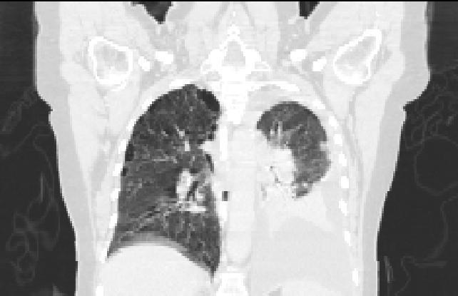
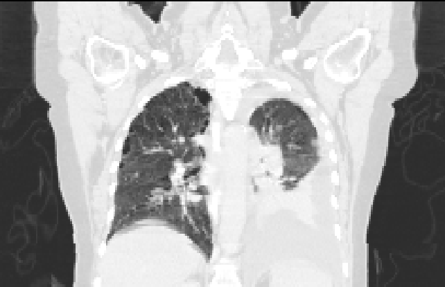
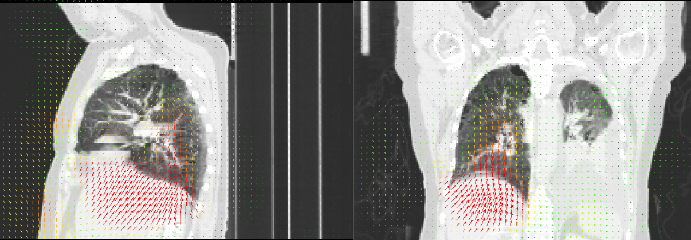

.. _registration_tutorial:

Image registration tutorial
===========================
This tutorial provides a brief introduction to the image registration
capabilities of plastimatch.  You will need an image viewing program 
such as 3D Slicer (http://slicer.org) to see your results.  

Download the sample data
^^^^^^^^^^^^^^^^^^^^^^^^
https://downloads.sourceforge.net/project/plastimatch/Sample%20Data/registration-tutorial.tar.gz/download
The sample data contains two 3D volumes from a 4D CT scan of a lung cancer
patient.  The file t0.mha is the inhale state and the file t5.mha is at
the exhale state.  You can see the original images below.

Run the registration
^^^^^^^^^^^^^^^^^^^^
The sample data includes a file called parms.txt, which is an example
of a registration command file needed to run a registration.
You can run the registration using the following command:

  plastimatch register parms.txt

When you run the registration, you will see a lot of text displayed
on the console.  When complete, a file called warped.mha is produced.

View the command file
^^^^^^^^^^^^^^^^^^^^^
Next, open up the command file in a text editor.  You should see the
following::

  [GLOBAL]
  fixed=t5.mha
  moving=t0.mha
  image_out=warped.mha

  [STAGE]
  xform=bspline

The GLOBAL section is where you specify your input and output files.
There should be only one GLOBAL section.  The STAGE sections are where you 
specify what kind of registration you want.  In this case, we specify
only that it is a B-spline registration.  

By default, a B-spline registration uses control point spacing of 20 mm.
Let's modify the registration to run in two stages: first at 50 mm,
and then at 20 mm.  Change the file as follows::

  [GLOBAL]
  fixed=t5.mha
  moving=t0.mha
  image_out=warped.mha

  [STAGE]
  xform=bspline
  grid_spac=50 50 50

  [STAGE]
  grid_spac=20 20 20

Please note that when you re-run the registration, it overwrites
the existing 
output file.  If you also want to export the deformation vector field, 
modify the file again to this::
  

  [GLOBAL]
  fixed=t5.mha
  moving=t0.mha
  image_out=warped.mha
  vf_out=deformation.nrrd

  [STAGE]
  xform=bspline
  grid_spac=50 50 50

  [STAGE]
  grid_spac=20 20 20

When you run again, you should find that a file named deformation.nrrd
was created.  You can load this file in 3D Slicer as a deformation
field (choose Transform in the Description pulldown when you load).
The result can be overlaid as shown below.

