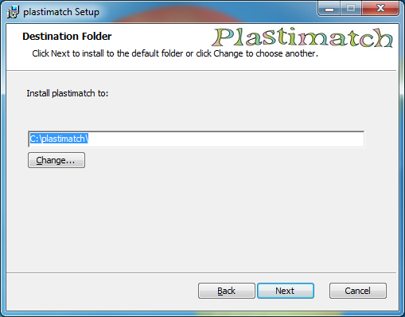

.. _windows_installation:

User manual for plastimatch 1.6.4 windows binary
================================================

#. Download a plastimatch window binary file
 #. Webpage for download: https://sourceforge.net/projects/plastimatch/files/Windows%20Binaries/
 #. Download either win64 or win32 according to your windows version.
#. Run the downloaded “plastimatch-1.6.4-winOO.msi” file
 #. During the installation, specify the installation directory. Default directory may be “C:/Program Files/~”.  To avoid any access permission issue, a user-created folder is recommended.

#. Prepare the command line prompt.
 #. Browse the plastimatch “bin” folder where all the binary files are installed.
 #. Right mouse click at the “launch_cmd_prompt.bat” file and do “Run as administrator”.

      
